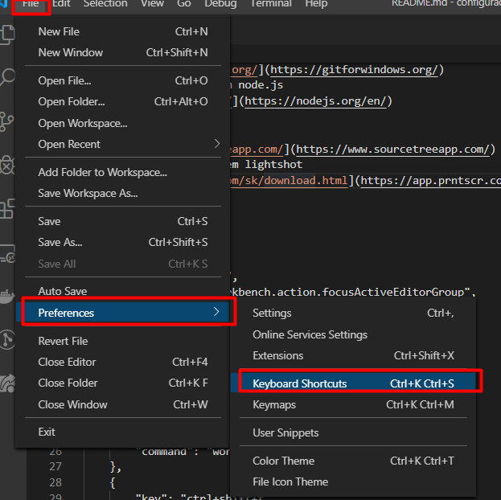
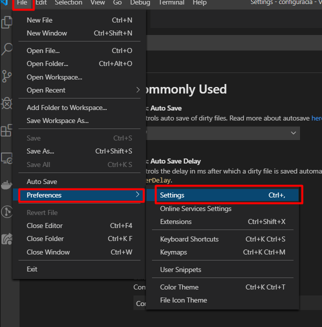

1. stiahnem si git bash a nainštalujem
   [https://gitforwindows.org/](https://gitforwindows.org/)
2. stihanem naintalujem node.js
   [https://nodejs.org/en/](https://nodejs.org/en/)
   stahujem LTS version
3. stiahnem sourcetree
   [https://www.sourcetreeapp.com/](https://www.sourcetreeapp.com/)
4. stiahnem nainstalujem lightshot
   [https://app.prntscr.com/sk/download.html](https://app.prntscr.com/sk/download.html)
5. stiahnem a nainstalujem fonty firacode
   [https://github.com/frantallukas10/FiraCode-best-font-vscode](https://github.com/frantallukas10/FiraCode-best-font-vscode)
6. nastavovanie vscodu

- keybindings.json
  skratky nastavime takto
  

```json
[
	{
		"key": "ctrl+`",
		"command": "workbench.action.focusActiveEditorGroup",
		"when": "terminalFocus"
	},
	{
		"key": "ctrl+`",
		"command": "workbench.action.terminal.focus",
		"when": "!terminalFocus"
	},
	{
		"key": "ctrl+alt+o",
		"command": "workbench.action.files.openFolder"
	},
	{
		"key": "ctrl+shift+t",
		"command": "shellLauncher.launch"
	}
]
```

- settings.json
  skratky nastavime takto
  

```json
{
	// ---------------------------------------- prettier
	"prettier.singleQuote": true,
	"prettier.bracketSpacing": true,
	"prettier.trailingComma": "es5",
	"prettier.useTabs": true,
	"prettier.semi": false,
	"prettier.arrowParens": "avoid",
	"prettier.jsxBracketSameLine": true,
	"editor.defaultFormatter": "esbenp.prettier-vscode",
	// ----------------------------------------
	"editor.formatOnPaste": true,
	"editor.formatOnSave": true,
	"editor.trimAutoWhitespace": true,
	"editor.fontLigatures": true,
	"editor.fontSize": 13,
	"editor.tabSize": 2,
	"editor.wordWrap": "on",
	"editor.minimap.maxColumn": 80,
	"editor.rulers": [120],
	// ----------------------------------------
	"workbench.iconTheme": "material-icon-theme",
	"explorer.confirmDelete": false,
	"explorer.confirmDragAndDrop": false,
	"window.zoomLevel": 1,
	"emmet.triggerExpansionOnTab": true, // emmet config
	"files.eol": "\n", // LF or CRLF
	"breadcrumbs.enabled": false,
	"html.format.indentHandlebars": true,
	"html.format.indentInnerHtml": true,
	"html.format.wrapLineLength": 100,
	"[markdown]": {
		"editor.wordWrap": "wordWrapColumn",
		"editor.wordWrapColumn": 100
	},
	"javascript.preferences.quoteStyle": "single",
	"typescript.preferences.quoteStyle": "single",
	// ---------------------------------------- terminal config
	"terminal.integrated.fontSize": 14,
	"terminal.external.windowsExec": "C:\\\\Program Files\\\\Git\\\\bin\\\\bash.exe",
	"terminal.integrated.shell.windows": "C:\\Program Files\\Git\\bin\\bash.exe",
	// ----------------------------------------
	"shellLauncher.shells.windows": [
		{
			"shell": "C:\\Windows\\SysWOW64\\cmd.exe",
			"label": "cmd"
		},
		{
			"shell": "C:\\Windows\\SysWOW64\\WindowsPowerShell\\v1.0\\powershell.exe",
			"label": "PowerShell"
		},
		{
			"shell": "C:\\Program Files\\Git\\bin\\bash.exe",
			"label": "Git bash"
		}
	],
	// ---------------------------------------- projectManager extension
	"projectManager.groupList": true,
	"projectManager.openInNewWindowWhenClickingInStatusBar": true,
	"projectManager.git.baseFolders": [
		"C:\\Users\\Ľudka\\Documents\\programovanie\\project"
	],
	// ----------------------------------------
	"highlight-matching-tag.styles": {
		"opening": {
			"left": {
				"custom": {
					"borderWidth": "0 0 0 3px",
					"borderStyle": "solid",
					"borderColor": "yellow",
					"borderRadius": "5px",
					"overviewRulerColor": "white"
				}
			},
			"right": {
				"custom": {
					"borderWidth": "0 3px 0 0",
					"borderStyle": "solid",
					"borderColor": "yellow",
					"borderRadius": "5px",
					"overviewRulerColor": "white"
				}
			}
		}
	},
	// ---------------------------------------- npm intellisense
	"npm-intellisense.importES6": true,
	"npm-intellisense.importQuotes": "'",
	"npm-intellisense.importLinebreak": ";\r\n",
	"npm-intellisense.importDeclarationType": "const",
	"npm-intellisense.scanDevDependencies": true,
	"npm-intellisense.showBuildInLibs": true,
	"npm-intellisense.recursivePackageJsonLookup": true,
	"npm-intellisense.packageSubfoldersIntellisense": true,
	"workbench.startupEditor": "newUntitledFile",
	"colorize.languages": ["javascript"],
	"editor.matchBrackets": false,
	"diffEditor.ignoreTrimWhitespace": true,
	"workbench.colorTheme": "Default Dark+",
	"git.autofetch": true
}
```

- instalacia extensions
  spustim prikaz

```
bash extensions.sh
```

ak chcem zistit aktualny zoznam extensions

```
code --list-extensions
```

7. vytvorim si ssh key a pridam ho do githubu podla toho
   [https://help.github.com/en/github/authenticating-to-github/generating-a-new-ssh-key-and-adding-it-to-the-ssh-agent](https://help.github.com/en/github/authenticating-to-github/generating-a-new-ssh-key-and-adding-it-to-the-ssh-agent)

8. git konfiguracia

v terminali spustim tento prikaz

```
code ~/.gitconfig"
```

nasledne skopirujem

```
[core]
	editor = code --wait
	eol = lf
	autocrlf = input
#---------------
[difftool "sourcetree"]
	cmd = '' \"$LOCAL\" \"$REMOTE\"
[mergetool "sourcetree"]
	cmd = "'' "
	trustExitCode = true
[rebase]
	autosquash = true
#---------------
[includeIf "gitdir:~/Documents/work/"]
	path = ~/.gitconfig-work
[includeIf "gitdir:~/Documents/projects"]
	path = ~/.gitconfig-project
```

pomocou tohto prikazu vytvorim subor pre git aby som vedel odlisit konfiguraciu pre usera
podla tohot v akom priecinku pracujem

```
code ~/.gitconfig-project
```

skopirujem tam nastavenie usera pre projekty

```
[user]
  name = Ľudmila Jalčová
  email = lu.jalcova@gmail.com
```

to iste urobim pre work

```
code ~/.gitconfig-work
```

skopirujem tam nastavenie usera pre projekty

```
[user]
  name = Ľudmila Jalčová
  email = lu.jalcova@gmail.com
```

8. git alias
   pomocou tohto prikazu vytvorim zakladne aliasy

```
code ~/.bashrc
```

vytvori sa mi subor a do nieho skopirujem toto

```
alias config="code ~/ -r"
alias sb="code ~/.bashrc"
alias sg="code ~/.gitconfig"

alias showw="code ~/workAlliases.sh"
alias showg="code ~/gitAlliases.sh"

alias vsk="code ~/AppData/Roaming/Code/User/keybindings.json"
alias vss="code ~/AppData/Roaming/Code/User/settings.json"
alias rb="\"C:/Program Files/Git/git-bash.exe\" --cd-to-home"

source ~/workAlliases.sh # import invisible custom alliases file
source ~/gitAlliases.sh # import invisible custom alliases file
```

nasledne si vytvorim subor pomocou prikazu

```
code ~/workAlliases.sh
```

a skoprirujem si tam

```
#!/bin/bash

alias ys="yarn start"
alias showssh="code ~/.ssh/id_rsa.pub"
alias listnpm="npm list -g --depth 0"
```

nasledne si vytvorim subor pomocou prikazu

```
code ~/gitAlliases.sh
```
Git aliasy a vysvetlenie:

# git aliases

## git status

- zobrazi aktualny stav branche

```bash
alias gitst="git status"
```

- pripravi zmeny na commit

## git add

```bash
alias gitaa="git add -A ."
```

## git reset

- vrati svoje nove zmeny nad repozitarom na stav up to date nepouzivať dva krat po sebe lebo sa začneš presuvať stale o jeden commit spať

```bash
alias gitrhb="git reset --hard"
```

- zmazanie jedneho nepushnuteho pripraveneho commitu

```bash
alias gitrh="git reset --hard HEAD^" # git reset --hard HEAD^1
```

- ak som pushol commit do repositara a chcem ho vratiť späť ->`git cm "message"` -> `git puf`

```bash
alias gitrsh="git reset --soft HEAD~" # git reset --soft HEAD~1
```

## checkout

- vrati ma na predoslu branchu kde som bol pred tym

```bash
alias gitco-="git checkout -"
```

- presunie ma na inu branchu

```bash
alias gitco="git checkout" # git checkout "nazov_branche"
```

- vytvori novu branchu a presunie ma tam

```bash
alias gitcob="git checkout -b" # git checkout -b "nazov_branche"
```

## merge

- vies mergnut vsetky zmeny vramci napr. develop branche do master branche alebo tvojej vytvorenej branche do mastra

```bash
alias gitm="git merge" # git merge develop master ||| git merge "nazov_tvojej_branche" master
```

## commit

- vytvorenie commitu musis definovat nazov commitu

```bash
alias gitcm="git commit -m" # git commit -m "nazov_commitu"
```

- ked chces do definovaneho commit vlozit dalsie upravy musis definovat cislo o kolko komitov chces urobit zmeny

```bash
alias gitcf="git commit --fixup" # git commit --fixup 1 -> git rebiad -> git ca -> git puf
```

- zaslem zmenu do predosleho commitu

```bash
alias gitcan="git commit --amend --no-edit"
```

- zmena nazvu predosleho commitu zaslem zmenu do predosleho commitu a mozem zmenit nazov commitu môžem aj hneď definovať novy nazov

```bash
alias gitcam="git commit --amend -m" # git commit --amend -m "novy_nazov_commitu"
```

## cherry-pick

- skopiruje zmeny z ktorehokolvek pushnuteho commitu je nutne definovat hash commitu

```bash
alias gitcp="git cherry-pick" # git cherry-pick "1dd68ba"
```

## push

- pushnem vsetky zmeny do repositara

```bash
alias gitpu="git push"
```

- pushnem vsetky zmeny do repositara na silu vacsinou sa to pouziva po gitca alebo po upravach rebasu

```bash
alias gitpuf="git push -f"
```

- tento prikaz je nutne pouziť ak si vytvoriš novu vetvu teda branchu a chceš ju pushnuť do orgiin aby ju videli aj kolegovia ale nechces ju pushnuť do mastra alebo develop branche

```bash
alias gitpus="git push -u origin HEAD"
```

## stash

- ulozim si docasne zmeny bez pushu

```bash
alias gitstm="git stash save" # git stash save "nazov_ulozeneho_stashu"
```

- prikas ti ukaze zoznam docasne ulozenych zmien lokalne u teba bez pushu

```bash
alias gitstl="git stash list"
```

- zmazem ulozeny stash pod svojim ulozenym nazvom

```bash
alias gitstd="git stash drop" # git stash drop "nazov_ulozeneho_stashu"
```

- chem na aktualnom mieste použiť zmeny zo stashu a nasledne ich zmazať zo stashu

```bash
alias gitstp="git stash pop" # git stash pop "nazov_ulozeneho_stashu"
```

## rebase

- pomocou tohto prikazu viem zapnut takzvany interaktivny mod, po spusteni sa otovori okno kde si mozem nastavit aku akciu chcem vykonat

```bash
alias gitrebi="git rebase -i"
```

- tymto prikazom chcem ukoncit interaktivny mod ale da sa vykonat ak su vsetky zmeny pushnute

```bash
alias gitrebc="git rebase --continue"
```

- vratit vsetky zmeny do povodneho stavu vramci interaktivneho modu

```bash
alias gitrebs="git rebase --skip"
```

## naopakovanejsie prikazy po sebe

- dostat aktualne zmeny do predosleho pushnuteho komitu

```bash
alias gitrw="git aa && gca && gpuf"
```

## lost commit

- kedze vramci gitovania nemozes nikdy nic stratit pomocou tychto prikazov sa vies pozriet aj na hladane zmeny a prepisane zmeny...

```bash
alias gitfh1="git fsck --lost-found"
alias gitfh2="git reflog"
```

Tieto nastavenia si mozme skopirovat odtialto:
```
#!/bin/bash

#---------------
# zobrazi aktualny stav branche
alias gitst="git status"
# pripravi zmeny na commit
alias gitaa="git add -A ."
# vrati svoje nove zmeny nad repozitarom na stav up to date nepouzivať dva krat po sebe lebo sa začneš presuvať stale o jeden commit spať
alias gitrh="git reset --hard"
# ak som pushol commit do repositara a chcem ho vratiť späť ->`git cm "message"` -> `git puf`
alias gitrsh="echo 'zadaj číslo o kolko pushnutych komitov chceš isť späť:'
              read A
              git reset --soft HEAD^$1" # git reset --soft HEAD~1
#--------------- checkout
# vrati ma na predoslu branchu kde som bol pred tym
alias gitco-="git checkout -"
# presunie ma na inu branchu
alias gitco="git checkout" # git checkout "nazov_branche"
# vytvori novu branchu a presunie ma tam
alias gitcob="git checkout -b" # git checkout -b "nazov_branche"
#--------------- branch
# vies mergnut vsetky zmeny vramci napr. develop branche do master branche alebo tvojej vytvorenej branche do mastra
alias gitm="git merge" # git merge develop master ||| git merge "nazov_tvojej_branche" master
#--------------- commit
# vytvorenie commitu musis definovat nazov commitu
alias gitcm="git commit -m" # git commit -m "nazov_commitu"
# ked chces do definovaneho commit vlozit dalsie upravy musis definovat cislo o kolko komitov chces urobit zmeny
alias gitcf="git commit --fixup" # git commit --fixup 1 -> git rebiad -> git ca -> git puf
# zaslem zmenu do predosleho commitu
alias gitcan="git commit --amend --no-edit"
# zmena nazvu predosleho commitu zaslem zmenu do predosleho commitu a mozem zmenit nazov commitu môžem aj hneď definovať novy nazov
alias gitcam="git commit --amend -m" # git commit --amend -m "novy_nazov_commitu"
#--------------- cherry-pick
# skopiruje zmeny z ktorehokolvek pushnuteho commitu je nutne definovat hash commitu
alias gitcp="git cherry-pick" # git cherry-pick "1dd68ba"
#--------------- push
# pushnem vsetky zmeny do repositara
alias gitpu="git push"
# pushnem vsetky zmeny do repositara na silu vacsinou sa to pouziva po gitca alebo po upravach rebasu
alias gitpuf="git push -f"
# tento prikaz je nutne pouziť ak si vytvoriš novu vetvu teda branchu a chceš ju pushnuť do orgiin aby ju videli aj kolegovia ale nechces ju pushnuť do mastra alebo develop branche
alias gitpus="git push -u origin HEAD"
#--------------- stash
# ulozim si docasne zmeny bez pushu
alias gitstm="git stash save" # git stash save "nazov_ulozeneho_stashu"
# prikas ti ukaze zoznam docasne ulozenych zmien lokalne u teba bez pushu
alias gitstl="git stash list"
# zmazem ulozeny stash pod svojim ulozenym nazvom
alias gitstd="git stash drop" # git stash drop "nazov_ulozeneho_stashu"
# chem na aktualnom mieste použiť zmeny zo stashu a nasledne ich zmazať zo stashu
alias gitstp="git stash pop" # git stash pop "nazov_ulozeneho_stashu"
#--------------- rebase
# pomocou tohto prikazu viem zapnut takzvany interaktivny mod, po spusteni sa otovori okno kde si mozem nastavit aku akciu chcem vykonat
alias gitrebi="git rebase -i"
# tymto prikazom chcem ukoncit interaktivny mod ale da sa vykonat ak su vsetky zmeny pushnute
alias gitrebc="git rebase --continue"
# vratit vsetky zmeny do povodneho stavu vramci interaktivneho modu
alias gitrebs="git rebase --skip"
# nepamatam
alias gitrebt="git rebase --edit-todo"
# nepamatam
alias gitrebiad="git rebase -i --autosquash develop"
#-------------- naopakovanejsie prikazy po sebe
# dostat aktualne zmeny do predosleho pushnuteho komitu
alias gitrw="gitaa && gitcan && gitpuf"
#-------------- lost commit
# kedze vramci gitovania nemozes nikdy nic stratit pomocou tychto prikazov sa vies pozriet aj na hladane zmeny a prepisane zmeny...
alias gitfh1="git fsck --lost-found"
alias gitfh2="git reflog"

```
